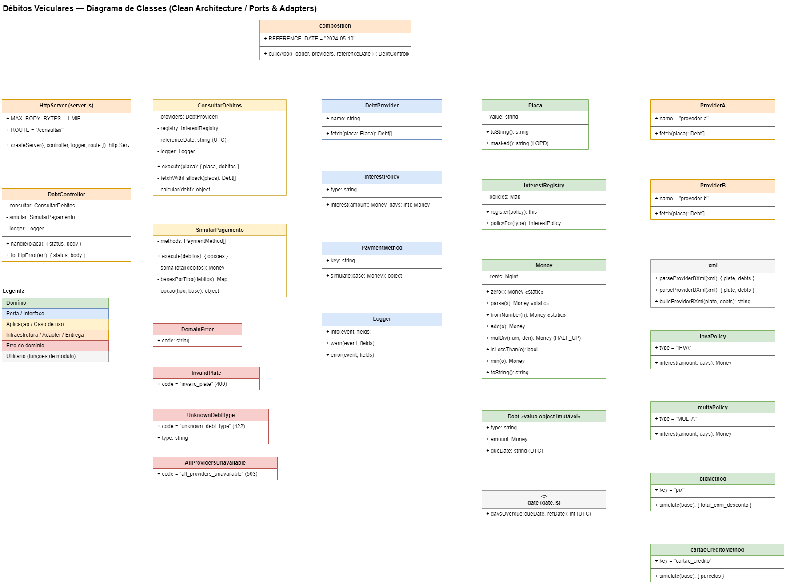

# Débitos Veiculares — Node.js

Serviço HTTP que, a partir de uma placa, consulta múltiplos provedores externos
(em formatos diferentes), normaliza os débitos em um modelo canônico, recalcula os
valores com **juros simples** e simula pagamento via **PIX** e **cartão de crédito**
(total ou parcial por tipo), com **fallback** entre provedores.

Especificação completa em [`../HomeTest.md`](../HomeTest.md).


## Requisitos

- Node.js 24 (ver [`.nvmrc`](.nvmrc)). **Sem dependências de terceiros** — apenas a
  biblioteca padrão (`node:http`, `node:test`, `node:assert`).

## Como rodar

```bash
# subir a API (porta 8080 por padrão; configurável via env var PORT)
npm start

# rodar os testes
npm test
```

Exemplo de chamada:

```bash
curl -X POST localhost:8080/consultas \
  -H 'Content-Type: application/json' \
  -d '{"placa":"ABC1234"}'
```

- A placa de teste `ABC1234` devolve exatamente a saída do enunciado.
- A placa de teste `ABC6789` devolve débitos com 2 dias de atraso.
- A placa de teste `ABC5678` devolve débitos sem atrasos.

Qualquer outra
placa válida retorna sem débitos (provedores simulados em memória).

## Endpoint

`POST /consultas` — corpo `{"placa":"ABC1234"}`.

| Situação                         | Status | Corpo                                              |
| -------------------------------- | ------ | -------------------------------------------------- |
| Sucesso                          | 200    | consulta + simulação de pagamento                  |
| Placa fora do padrão             | 400    | `{"error":"invalid_plate"}`                         |
| Tipo de débito sem regra de juros| 422    | `{"error":"unknown_debt_type","type":"<TIPO>"}`     |
| Todos os provedores falharam     | 503    | `{"error":"all_providers_unavailable"}`             |
| Envelope inválido / campo extra  | 400    | `{"error":"invalid_request"}`                       |
| Corpo acima de 1 MiB             | 413    | `{"error":"payload_too_large"}`                     |

## Estrutura

Camadas com dependências sempre apontando **para dentro** (domínio no centro, modelo hexagonal):



```
src/
  domain/          Regras de negócio puras (sem I/O)
    money.js         Value object monetário (decimal exato em centavos/BigInt)
    placa.js         Validação Mercosul/antiga + mascaramento (LGPD)
    debt.js          Modelo canônico de débito
    date.js          Dias de atraso em UTC
    interest/        Juros por tipo (Strategy): ipva, multa + registry
    errors.js        Exceções de domínio tipadas
  application/     Casos de uso (orquestram o domínio via portas)
    consultarDebitos.js   Fallback entre provedores + cálculo de juros
    simularPagamento.js   Opções TOTAL e SOMENTE_<TIPO>
  payment/         Meios de pagamento (Strategy): pix, cartaoCredito
  infrastructure/  Detalhes de borda (adapters e entrega)
    providers/       Adapters JSON (A) e XML (B) + backends simulados
    http/            Servidor, roteamento e controller
    logger.js        Logs estruturados (JSON)
  composition.js   Composition root: instancia e conecta tudo
  index.js         Entrada: sobe o servidor
tests/             Testes unitários e de integração (node:test)
```

## Padrões utilizados

As decisões e os padrões abaixo estão detalhados em [`adr.md`](adr.md).

- **Ports & Adapters / Clean Architecture** — o domínio não conhece HTTP, JSON nem XML.
- **Adapter** — `providerA` (JSON) e `providerB` (XML) traduzem cada formato externo
  para o mesmo modelo canônico `Debt`.
- **Strategy + Registro** — uma policy de juros por tipo de débito e um meio de pagamento
  por estratégia. Adicionar IPVA/MULTA/LICENCIAMENTO ou PIX/cartão = **nova classe
  registrada**, sem alterar as existentes (OCP).
- **Injeção de dependências manual** no composition root (sem container/framework).

## Decisões técnicas

- **Dinheiro sem float.** `Money` guarda centavos como `BigInt`. Juros, teto, PIX e
  Price/PMT são feitos como frações inteiras com arredondamento **HALF_UP**, então a
  saída bate **exatamente** com os exemplos da spec (inclusive as parcelas do cartão).
  - Price/PMT reescrito de forma exata: `parcela = base × 41^n / (40 × (41^n − 40^n))`,
    equivalente a `base × i × (1+i)^n / ((1+i)^n − 1)` com `i = 0,025`.
- **Sem bibliotecas.** Servidor com `node:http`; XML do Provedor B com um parser/serializer
  mínimo por regex (formato fixo e conhecido); testes com `node:test` + `node:assert`.
- **Data de referência fixa** `2024-05-10` (UTC), configurável no composition root.
- **Resiliência.** `ConsultarDebitos` tenta os provedores na ordem; lista vazia é
  sucesso (não dispara fallback); só quando **todos** falham retorna 503.
- **Borda da requisição.** Limite de ~1 MiB e rejeição de JSON com campos desconhecidos.

## Provedores divergentes (estratégia)

Os adapters já normalizam para o mesmo modelo canônico, então comparar respostas é
trivial. A estratégia adotada é **first-wins com fallback**: usamos a resposta do
primeiro provedor saudável na ordem configurada (mais confiável primeiro). Caso fosse
necessário reconciliar divergências, as extensões naturais seriam: consultar todos e
aplicar quórum/maioria por débito (chave `tipo`+`vencimento`), ou priorizar por
política de negócio (ex.: maior valor por segurança), registrando a divergência em log.

## Melhorias futuras

- Retry com backoff e circuit breaker por provedor.
- Provedores reais (HTTP) com timeout, mantendo os mesmos adapters.
- Cache de consultas e métricas/observabilidade.
- Reconciliação de divergências entre provedores (ver acima).

## Decisões de negócio

- O enunciado tem duas frases sobre `unknown_debt_type`: nas regras de negócio, **qualquer**
  tipo desconhecido deve gerar 422 ("não silenciar"); na seção de requisitos fala em
  "quando **todos** os débitos são de tipo desconhecido". Foi adotada a interpretação mais
  estrita e segura: **qualquer** débito de tipo sem regra de juros gera 422 com o `type`.
